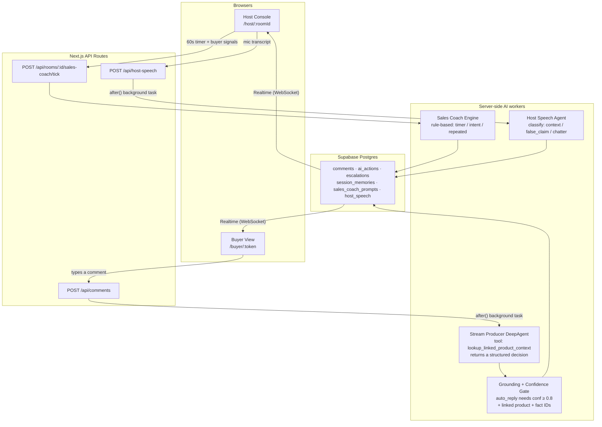
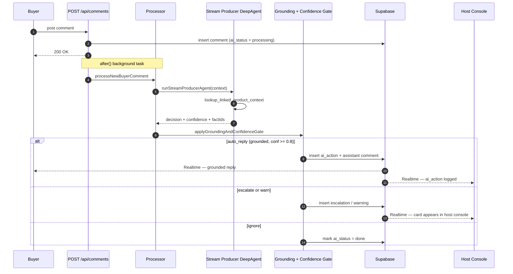
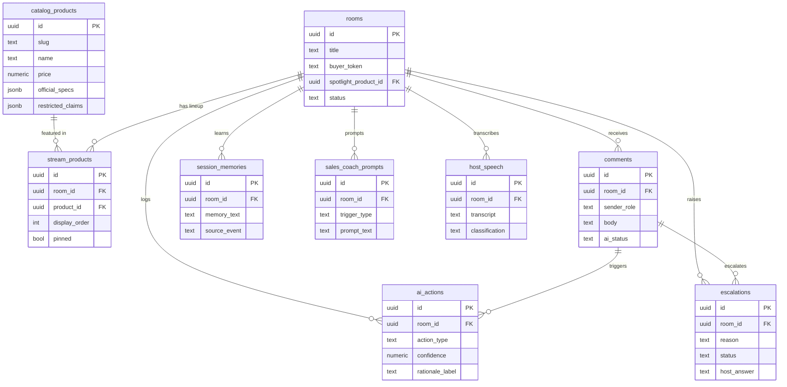

<div align="center">

# 🎬 Shopee Live Producer

**An AI backstage producer for livestream commerce.**

It watches buyer chat, answers grounded product questions, escalates uncertainty to the host, flags policy risks, and coaches the seller — all in real time.

[](https://nextjs.org/)
[](https://react.dev/)
[](https://www.typescriptlang.org/)
[](https://supabase.com/)
[](https://langchain.com/)
[](LICENSE)
[](https://technode.global/2026/05/14/sea-openai-launch-apac-ai-hackathon-series-starting-in-singapore-in-june/)

<sub>🥉 <b>3rd place</b> — built by <b>team techbros</b> at the Sea × OpenAI Regional Codex Hackathon · Singapore, June 2026</sub>

</div>

---

> [!NOTE]
> ## 🥉 3rd Place — Sea × OpenAI Codex Hackathon
>
> Shopee Live Producer took **3rd place**, built by **team techbros** at the **Sea × OpenAI Regional Codex Hackathon** in Singapore on **6 June 2026** — the *first* Codex Hackathon in APAC, where 100+ developers shipped 50+ projects with OpenAI Codex in a single day. It was the opening event of a regional series that continues across Indonesia, Taiwan, and Vietnam.
>
> 📰 Coverage: [Tech in Asia](https://www.techinasia.com/sea-openai-unite-singapores-ai-builders-codex-hackathon) · [Announcement (TechNode Global)](https://technode.global/2026/05/14/sea-openai-launch-apac-ai-hackathon-series-starting-in-singapore-in-june/)

---

## Table of Contents

- [Why](#why)
- [What it does](#what-it-does)
- [Live demo script](#live-demo-script)
- [Features](#features)
- [Architecture](#architecture)
- [How a comment flows](#how-a-comment-flows)
- [Data model](#data-model)
- [Tech stack](#tech-stack)
- [Quick start](#quick-start)
- [Environment variables](#environment-variables)
- [Seeded catalog](#seeded-catalog)
- [Project structure](#project-structure)
- [Development](#development)
- [How this differs from a chatbot](#how-this-differs-from-a-chatbot)
- [License](#license)

---

## Why

Shopee Live hosts sell, answer questions, keep energy high, and stay policy-safe — all at once. In a busy live chat, hosts miss product questions, repeat the same answers, forget to push promos, and occasionally make unsupported claims.

A chatbot that auto-replies to *everything* makes it worse. **The key insight: the AI is a _producer_, not a _chatbot_.** It decides what to say, what to escalate, what to ignore, and what to warn — and it shows its work.

## What it does

A two-sided live room where an AI **live producer** works *backstage*:

- 💬 **Answers grounded questions instantly** — buyers ask, the AI replies only when it's confident and the answer is backed by real product facts.
- 🙋 **Escalates uncertainty** — questions it can't ground get routed to the host with the matched product and a reason, rather than guessed at.
- 🧠 **Remembers host answers** — a host reply becomes **session memory**, so repeated questions answer themselves.
- 🚩 **Flags policy risk** — medical claims, unsupported guarantees, and other restricted claims are caught *before* they reach buyers.
- 📈 **Coaches the seller** — a rule-based engine watches timers and buyer-intent signals, nudging the host on benefits, promos, and spotlight-worthy moments.

## Live demo script

Open a **host** window and a **buyer** window side by side, then run this script:

| Window | Action | What the producer does |
|--------|--------|------------------------|
| **Buyer** | `"Does the XM6 support LDAC?"` | Auto-answers with grounded spec facts |
| **Buyer** | `"hello hello hello"` | No reply fires — chatter is silently filtered |
| **Buyer** | `"Do you still have the blue one in stock?"` | Escalation card appears with the matched product + reason |
| **Host** | Type an answer → card resolves | Fact enters **session memory** |
| **Buyer** | Ask the stock question again | AI answers from memory — no host input needed |
| **Buyer** | `"Does the XM6 cure hearing issues?"` | Policy warning fires — medical claim blocked before it reaches buyers |

## Features

Built as ten vertical slices, each shippable on its own:

| # | Slice | What it delivers |
|---|-------|------------------|
| 001 | Seller setup | Browse seeded catalog, build a stream lineup, get host + buyer links |
| 002 | Real-time comment loop | Buyer comments appear in the host console live via Supabase Realtime |
| 003 | Host console | Live camera preview, chat, lineup, spotlight control |
| 004 | DeepAgent auto-answer | Grounded product Q&A posted as labeled AI messages |
| 005 | Spam filter | Social chatter and unlinked product questions receive no action |
| 006 | Escalation path | Uncertain questions routed to the host with product match + reason |
| 007 | Session memory | Host answers captured and surfaced for future identical questions |
| 008 | Policy warnings | Medical, legal, and unsupported-guarantee comments escalated before reply |
| 009 | Sales coach | Timer- and signal-triggered prompts: benefits, promos, FAQs |
| 010 | Activity log | Every AI decision logged with a compact rationale |

## Architecture

Three independent server-side AI paths feed a shared Postgres store; every browser stays in sync purely by subscribing to Realtime.



**Key design decisions**

- **Grounding gate, not prompt-level guardrails.** `applyGroundingAndConfidenceGate` runs *after* the agent and validates `supportingFactIds` against real in-context product rows before any auto-reply commits. The model proposes; the gate disposes.
- **Four decision classes, not free-form replies.** The agent must choose one of `auto_reply`, `escalate`, `warn`, or `ignore`. The frontend renders each differently so the host always knows the system's intent. (The `ai_actions` audit table records two more — `coach` and `memory` — for non-comment events.)
- **The sales coach is deterministic.** It's a rule engine (timers + cooldowns + intent detection), not an LLM call, so its prompts are cheap, predictable, and rate-limited.
- **Session memory is additive, not mutative.** Host answers extend a stream's context but never overwrite the seeded product catalog.
- **AI workers run server-side.** Model keys never reach the browser; the browser only subscribes to outcomes via Realtime.

## How a comment flows

The comment path is the heart of the system. The HTTP request returns immediately; the AI runs in a Next.js `after()` background task and pushes results back over Realtime.



## Data model

Nine tables, all scoped to a `room`. Core types live in [`src/lib/types.ts`](src/lib/types.ts) and mirror [`supabase/migrations/0001_initial_schema.sql`](supabase/migrations/0001_initial_schema.sql).



## Tech stack

| Layer | Technology |
|-------|------------|
| Frontend | Next.js 15 (App Router), React 19, TypeScript, Tailwind CSS |
| Realtime | Supabase Realtime — Postgres-backed WebSocket subscriptions |
| Database | Supabase Postgres with Row Level Security (buyers can comment; AI writes use the secret key) |
| AI agent | LangChain DeepAgent with `streamProducerDecisionSchema` structured output |
| Model | OpenAI, configurable via `STREAM_PRODUCER_MODEL` (defaults to `openai:gpt-5.4`) |
| Tests | Vitest — triage, grounding gate, memory, sales coach |

## Quick start

**Prerequisites:** Node.js 20+, a Supabase project, and an OpenAI API key.

```bash
# 1. Install dependencies
npm install

# 2. Configure environment
cp .env.local.example .env.local
# then fill in the variables below

# 3. Apply migrations + seed the catalog
npm run db:push

# 4. Run the dev server
npm run dev   # → http://localhost:3010
```

Then open the app, build a lineup, create a room, and open the generated **host** and **buyer** links in two windows.

## Environment variables

| Variable | Purpose |
|----------|---------|
| `NEXT_PUBLIC_SUPABASE_URL` | Supabase project URL |
| `NEXT_PUBLIC_SUPABASE_PUBLISHABLE_KEY` | Browser client key (`sb_publishable_…`) |
| `SUPABASE_SECRET_KEY` | Server key — bypasses RLS for privileged AI writes |
| `SUPABASE_DB_URL` | Session pooler URI, used by `db:push` only |
| `OPENAI_API_KEY` | Powers the Stream Producer DeepAgent |
| `STREAM_PRODUCER_MODEL` | *(optional)* model override; defaults to `openai:gpt-5.4` |

> [!TIP]
> Use the **Session pooler** connection string for `SUPABASE_DB_URL` (host like `aws-1-<region>.pooler.supabase.com`). The direct host is IPv6-only on newer projects and won't resolve from IPv4-only networks.

## Seeded catalog

| Product | Price | Key facts |
|---------|-------|-----------|
| Sony WH-1000XM6 | S$559 | LDAC / LC3, 30h ANC / 40h ANC-off, BT 5.3, carrying case |
| Logitech MX Master 3S | S$189 | 8K DPI, glass tracking (≥ 4 mm), MagSpeed scroll, quiet clicks |

Both products ship with variants, FAQs, shipping notes, promo fields, and a `restricted_claims` list — enough for the agent to realistically **answer**, **escalate**, and **warn**.

## Project structure

```text
src/
├── app/
│   ├── page.tsx                       # Seller setup: catalog → lineup → room
│   ├── host/[roomId]/page.tsx         # Host console
│   ├── buyer/[token]/page.tsx         # Buyer view
│   └── api/
│       ├── rooms/route.ts             # Create room + link lineup
│       ├── rooms/[roomId]/spotlight/  # Set / clear spotlight
│       ├── rooms/[roomId]/sales-coach/tick/  # Sales coach engine tick
│       ├── comments/route.ts          # Ingest comment → trigger DeepAgent
│       ├── escalations/[id]/route.ts  # Host resolves escalation → session memory
│       ├── memories/[id]/route.ts     # Dismiss / update session memory
│       └── host-speech/route.ts       # Host mic transcript → classify
├── components/
│   ├── HostConsole.tsx                # Main host dashboard
│   ├── EscalationsPanel.tsx           # Escalation queue + resolve UI
│   ├── SessionMemoryPanel.tsx         # Live memory viewer
│   ├── SalesCoachPanel.tsx            # Coach prompt feed
│   ├── BuyerView.tsx                  # Buyer chat + spotlight
│   └── useRoom*.ts                    # Realtime subscription hooks
└── lib/
    ├── streamProducerAgent.ts         # DeepAgent: classify → decide → ground
    ├── streamProducerProcessor.ts     # Persist AI action / reply / escalation
    ├── salesCoachEngine.ts            # Timer + signal → coach prompt
    ├── hostSpeechAgent.ts             # Host mic transcription classifier
    ├── supabase/{browser,server}.ts   # Supabase clients
    └── types.ts                       # Shared domain types
supabase/
├── migrations/*.sql                   # Schema, RLS, Realtime publication
└── seed.sql                           # Catalog seed
```

## Development

```bash
npm run dev         # Dev server at http://localhost:3010
npm run build       # Type-check + production build
npm run lint        # ESLint via next lint
npm test            # Unit tests (single run)
npm run test:watch  # Unit tests in watch mode
npm run db:push     # Apply migrations + seed to Supabase
```

Run a single test file:

```bash
npx vitest run src/lib/streamProducerAgent.test.ts
```

Tests cover the parts that must not regress: agent routing, the grounding gate, session memory, and the sales coach engine.

## How this differs from a chatbot

| A chatbot… | Shopee Live Producer… |
|------------|----------------------|
| Replies to everything | Classifies first — auto-reply, escalate, warn, or stay silent |
| Invents answers | Rejects answers with no supporting fact IDs at the grounding gate |
| Forgets between messages | Carries host-confirmed facts forward as session memory |
| Has no host awareness | Sends escalations, policy warnings, and coach prompts to the host |
| Has static knowledge | Learns new facts mid-stream from host answers |

## License

Released under the [MIT License](LICENSE).

<div align="center">
<sub>🥉 3rd place · built by team <b>techbros</b> with ☕ and OpenAI Codex at the Sea × OpenAI Regional Codex Hackathon 2026</sub>
</div>
